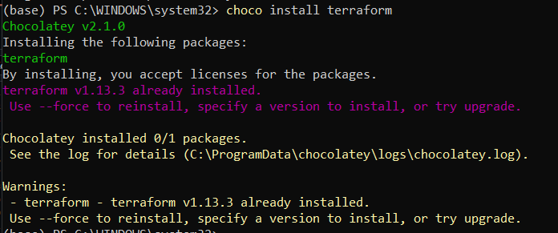
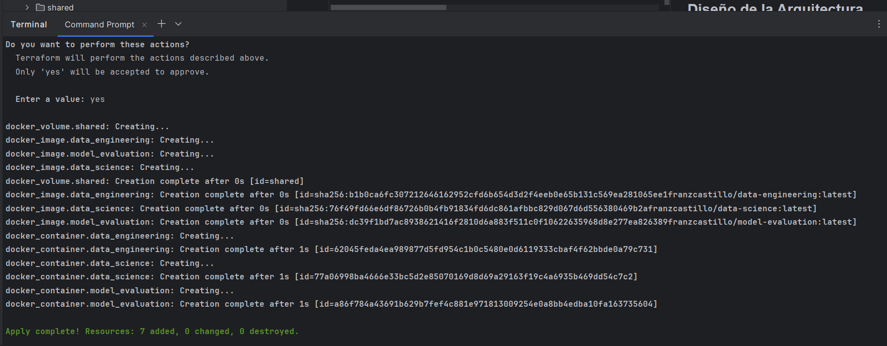
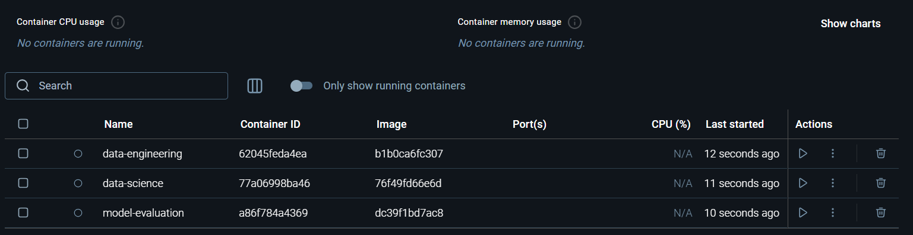

# Taller 6
- Francisco Castillo - 21562
- Diego Lemus - 21469 
- José Kiesling -

El código de este entregable puede encontrarse en el siguiente [repositorio](https://github.com/FranzCastillo/MLOps-Pipeline/tree/Docker).


## Tutorial de instalación y configuración 

### Instalación

```choco install terraform```



``` touch ~/.bashrc ```

``` terraform -install-autocomplete ```

## Configuración

``` terraform -v ```

``` terraform init ```

``` terraform plan ```

``` terraform apply ```

``` terraform destroy ```

## Documentación de Terraform y Docker
Terraform ofrece un tutorial de 7 pasos para poder desarrollar IaC en el siguiente [enlace](https://developer.hashicorp.com/terraform/tutorials/docker-get-started).

## Diseño de la Arquitectura
La arquitectura de este proyecto separa los procesos de ingeniería de datos y ciencia de datos utilizando contenedores Docker gestionados por Terraform. Los componentes principales son:
- `data-engineering/`: contiene el código y dependencias para la preparación de datos. Genera artefactos como dataset.pkl y preprocessor.pkl en la carpeta compartida.
- `data-science/`: incluye el código y dependencias para el entrenamiento y evaluación de modelos. Utiliza los artefactos de la carpeta compartida y produce el modelo entrenado model.pkl.
- `shared/`: almacena los archivos intercambiados entre los procesos de ingeniería y ciencia de datos.
- `main.tf`: define la infraestructura, los contenedores Docker y sus dependencias, asegurando que el proceso de ciencia de datos espere a que finalice el de ingeniería de datos.
- `docker-compose.yml`: alternativa para orquestar los contenedores localmente durante el desarrollo y pruebas.

### Creación del Ambiente



### Imagenes de Docker Hub
- [data-science](https://hub.docker.com/repository/docker/franzcastillo/data-science/general)
- [data-engineering](https://hub.docker.com/repository/docker/franzcastillo/data-engineering/general)
- [model-evaluation](https://hub.docker.com/repository/docker/franzcastillo/model-evaluation/general)

### Comandos para Desplegar Docker con Terraform
Podemos ver la documentación en este [enlace](https://registry.terraform.io/providers/kreuzwerker/docker/latest/docs).

## Conclusiones
- Reproducibilidad y consistencia: garantiza que los entornos de Data Engineering, Data Science y producción se levanten siempre con la misma configuración, reduciendo errores humanos y problemas de “funciona en mi máquina”.
- Escalabilidad controlada: permite definir en código cómo escalar recursos, lo que facilita aumentar capacidad de cómputo para entrenamiento de modelos o reducirla en etapas de prueba.
- Automatización y eficiencia operativa: elimina procesos manuales de configuración, acelerando la creación y destrucción de entornos de ETL y experimentación, lo que da más agilidad al ciclo de vida del ML.
- Trazabilidad y versionamiento: cada cambio en la infraestructura queda registrado en el código, permitiendo auditar quién, cuándo y cómo se modificaron los recursos.
